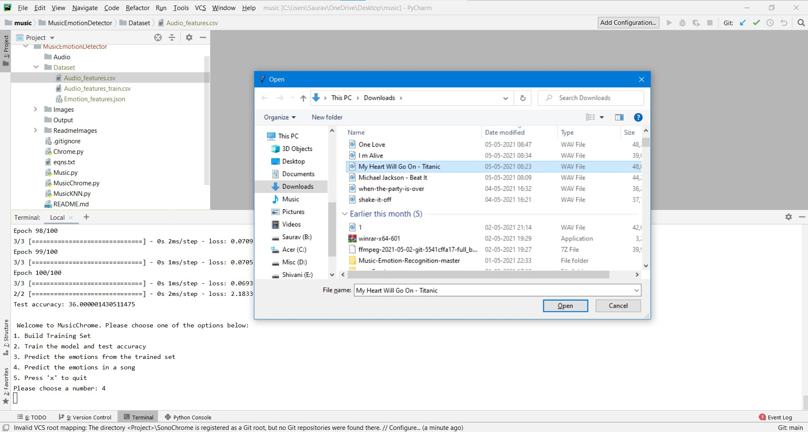

# Song Emotion Detection

This application can detect song emotions. We have focused on 6 song emotions - Exited, Happy, Pleaseful, Depressed, Sad and Anger. 

``` python
emotion_dict = {
    'excited': 0,
    'happy': 1,
    'peaceful': 2,
    'depressed': 3,
    'sad': 4,
    'angry': 5,
}
```
The csv file `Audio_features_train.csv`  in Dataset directory contains 75 songs with the labels and 54 attributes related to the song(to learn more about those features click [here](https://medium.com/tencent-thailand/music-information-retrieval-part-1-using-librosa-to-extract-audio-features-6e8569537185)
).


## Models

There are 2 methods where we can train the model:

1. Using ANN
2. Using KNN

In this project I have used ANN to train the model as it gives pretty good prediction. You can try using KNN by commenting the ANN callbacks and uncommenting the KNN callbacks.


## Important points to remember before executing `MusicChrome.py` each time:
1. Create an empty Output directory for running the code for the first time.
2. The Output directory should always be empty.
3. The `Audio_features.csv` file should be empty. Please don't confuse it with `Audio_features_train.csv` file.
4. Create an Audio directory containing some English songs which you want to predict on.

## About the python files

### There are 3 python files in this folder:
1. MusicChrome.py - The main file which you should execute.
2. Music.py - Contains ANN model
3. MusicKNN.py - Contains KNN model

## Running MusicChrome.py

Install the required libraries and run this file.

```python
python MusicChrome.py
```

```python
def show_options():
    print("\n Welcome to MusicChrome. Please choose one of the options below:")
    print("1. Build Training Set")
    print("2. Train the model and test accuracy")
    print("3. Predict the emotions from the trained set")
    print("4. Predict the emotions in a song")
    print("5. Press 'x' to quit")
    user_input = input("Please choose a number: ")
    return user_input
```
You'll be shown 4 options. I'll explain briefly what each option does:

1. Build Training Set: Put some songs in the Audio directory. Here audio features are extracted and written into `Audio_features.csv`. Don't add too many song files as it will take a lot of time to extract. After the extraction check the `Audio_features.csv`.
2. Train the model and test accuracy: Here the ANN/KNN model is trained on `Audio_features_train.csv`. This is crucial for the 3rd and 4th option to run else it will get an error.
3. Predict the emotions from the trained set: This will display an array of integers(length depending on the size of Audio directory) between 0-5(Check the Chrome.py file for reference) meaning the emotion of the song.
4. Predict the emotions in a song: File explorer will be prompted, select a song in **wav** format. if you don't have the song in the **wav** format then [convert it](https://cloudconvert.com/mp3-to-wav). The song will be broken into 5 seconds intervals and stored into Output directoy. The audio features of each chunk will be stored in `Audio_features.csv`. After this an array of integers(length depending on the size of Output directory) between 0-5 meaning the emotion of the song. The model is trained on English songs so **don't** select Hindi songs as it would give incorrect predictions.


## Results
1. 

2. 

3. 

4. 